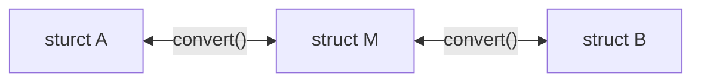

# 本日の学び

### 特定のhandlerに対する環境変数の読み込み
次のようなhandler定義に対して、handler外から情報を付加するには２つの方法がある。
*特にライブラリを使用してると遭遇する
```go
// ServerはServeHTTP(ResponseWriter, *Request)を満たしていて、ServeHTTPの前にhandlerが呼ばれる。
type Server struct {
  handler func(config Config) error
}

```
クロージャと構造体定義である。

クロージャ
- 余計な構造が外にでない、付加したい情報が少ない、ロジックを持つ必要がないときによい
構造体

構造体
- 構造が外に出るが、別の個所でまとめられる。ロジックの追加も用意
シチュエーションに応じてそれぞれ使い分けるのが良い

クロージャ
```go
type Server struct {
  handler func(config Config) error
}

func NewServer(secret string) *Server{
  return &Server{
    handler: func(config Config) error {
			return handShake(config, secret)
		},
	}
}

func handShake(config Config, secret string) error {
	return nil
}

```
構造体
```go
type Server struct {
  handler func(config Config) error
}

type Handshaker struct {
  secret string 
}

type (h *Handshaker) handShake(config) error {
  h.secret
}

func NewServer(h Handsahker) *Server{
  return &Server{
    handler: h.handshake
	}
}
```

### Req/Resの構造とサーバー内部の構造との変換について

構造B -> 構造Main -> 構造Aと変換したいとき、データの定義をどうするのが良いのか、一般的には次の構造が考えらえる

ここで、Main Serviceが状態を持っていて、その状態を考慮して`convert()`しないといけないとする。<br>
では、どうやってMainの状態を取得しながらconvert関数はstructBのみに集中できるだろうか？

まずはConvertorにManagerを持たせることを考える。Mangerが状態を管理しているので、`convert()`する際に、`m.GetState()`をすればよいのでは。
```go
type BtoMainConvertor struct {
  m MainServiceStateManager
}

func (m *BtoMainConvertor) convert(in string) *MainStruct {
  return &MainStruct
}
```

つぎに、convertする際、B->Mainの変換マップをMainが状態として持たないといけないとなった。
MainServiceStateMangerに`Register`と`Resolver`を実装し、変換をおこなて上げればよい。

```go
type BtoMainConvertor struct {
  m MainServiceStateManager
}

func (m *BtoMainConvertor) resolver() {
  m.Resolver()
}

func (m *BtoMainConvertor) register() {
  m.Register()
}

func (m *BtoMainConvertor) convert() {
  m.resolver()
  ...
}

func HandleB(in string) *MainStruct{
  m.resolver(in) // ensureを実装し、作成・確認を一度にできるとよい

  m.convert(in)
}
```

さて、こうやってmanagerにいっぱいステート管理を入れていくとmanagerがいろんなことをやる人になってしまった。これはよいのだろうか？

-> よくないので、コンポーネントに分割しよう。コンポーネントに分割して状態の持ち主を一つに絞り、それをひとつのオーケストレータが管理したらよい

### 状態の管理
これまで一つの接続の状態を考えてきたが、これが複数の接続になったときロック地獄になってしまうことが考えられる。つまり、`m.GetSession(connID)`などでmanager内部にある接続ひとつひとつの状態を取得、書き込みをするとロックを掛けざるを得ない。<br>
ではどうするか、ロックの粒度とルールを決めよう。

- 論理的に分離する
- RWMutex
- Sharding

などが利用できる。

*接続の間は、コネクションの状態を持っていたらいいのでは？

### 所感
OOP信者ぽくなってしまった。もっとゆるく生きていきたいね。